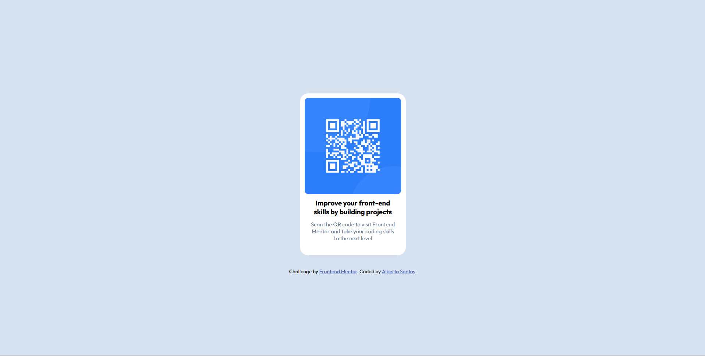

# Frontend Mentor - Solución de componente de código QR

Esta es una solución al [desafío de componente de código QR en Frontend Mentor](https://www.frontendmentor.io/challenges/qr-code-component-iux_sIO_H). Este es el primer desafío que pruebo de la plataforma frontendmentor, sencillito, para tantear el terreno.

## Tabla de contenidos

- [Descripción general](#descripcióngeneral)
- [Captura de pantalla](#capturadepantalla)
- [Enlaces](#enlaces)
- [Mi proceso](#mi-proceso)
- [Creado con](#creado-con)


## Descripción general
Este proyecto básicamente trata de crear una tarjeta centrada para el qr.

### Captura de pantalla


---


### Enlaces

- URL de la solución: [GitHub](https://github.com/AlbertGit8/qrCode)
- URL del sitio en vivo: [Netlify](https://qrcode-albertosantos.netlify.app/)

## Mi proceso

Lo primero ha sido crear la estructura de la tarjerta. He utilizado un div con clase contenedor para contener el contenido. La tarjeta esta dividida en una imagen y dos párrafos. Al último párrafo le he añadido una clase ```css .sub``` para diferenciarlo del párrafo principal.

Lo más complicado del estilo ha sido ajustar el tamaño de la tarjeta, me ha tocado decidir si cambiar el tamaño entre pantallas móbiles y ordenador o ajustar un simple tamaño. Al final he decido ajustar un tamaño que se vea bien en ambas pantallas.

### Creado con

- Marcado HTML5 semántico
- Propiedades personalizadas de CSS
- Flexbox

